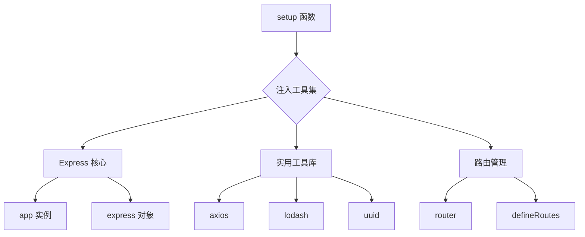

# 💥 Vite 插件：零配置开发 Node 接口方案

> **痛点直击**：你是否也遇到过这些场景？
>
> - 需要临时开发几个 Node 接口却不想新建后端项目
> - 想用 Express 但受限于 Vite 插件的简陋配置
> - 被重复的 try-catch 和错误处理折磨到崩溃

---

在前端工程化的开发中，会有一些需求要使用node编写辅助接口 ,比如 node接口转发,状态存储等等,而因为几个接口去创建一个后端项目并且部署,显然是不符合预期的,虽然Vite支持直接使用plugin编写express接口,但是不够模块化,也不够简洁(想造轮子了) 它们往往无法完全满足特定需求。于是，我开发了一个 **Vite 插件** —— **Vite Advance API**，它旨在简化前端 API 开发，支持多种路由定义方式，并提供统一的响应处理机制。

github地址: [LiCHUYA/vite-advance-API](https://github.com/LiCHUYA/vite-advance-API/tree/master)

## 🌟 功能全景

### 1. **错误系统**

该插件集成了 `express-async-errors`，使得在编写异步路由时，开发者不需要手动处理 `try-catch`，插件会自动捕获错误并将其传递给错误处理中间件，从而简化代码。


|          | 传统方案               | 本插件方案          |
| -------- | ---------------------- | ------------------- |
| 代码量   | 😫 冗余 try-catch 嵌套 | 😍 零错误处理代码   |
| 维护性   | 😰 分散在各处          | 😎 集中式错误中间件 |
| 响应规范 | 😵 格式混乱            | 🤖 自动统一错误格式 |

```js
// 传统方案 vs 插件方案
// ❌ 旧世界
app.get("/data", async (req, res, next) => {
  try {
    const data = await fetchData();
    res.json(data);
  } catch (err) {
    next(new Error("数据获取失败"));
  }
});

// ✅ 新世界
app.get("/data", async (req, res) => {
  const data = await fetchData();
  res.success(data); // 自动处理错误和响应
});
```

### 2.灵活的配置

Vite Advance API 提供了模块化的路由设计，支持通过 `ModuleConfig` 配置多种路由注册方式（如 `object` 和 `direct`）。此外，插件还具备如下特性：

- 支持全局基础路径配置 (`globalBase`)
- 统一的路由定义接口
- 支持所有主要的 HTTP 方法（`GET`, `POST`, `PUT`, `DELETE`）
- 统一的响应处理机制
- 集成常用工具库（如 `lodash`, `axios`, `uuid`）
- 默认支持 CORS
- 内置 `body-parser`（`express.json` 和 `express.urlencoded`）

## 🚀 五分钟极速入门

### 1. 安装插件

```bash
# 选你喜欢的包管理器
pnpm add vite-advance-api -D
# 或
npm install vite-advance-api -D
```

### 2. 基础配置

```ts
// vite.config.ts
import { defineConfig } from "vite";
import { createAdvanceApi } from "vite-advance-api";

export default defineConfig({
  plugins: [
    createAdvanceApi({
      prefix: "/api", // 全局路由前缀
      cors: { origin: "*" }, // 开发环境跨域
      setup: ({ axios, uuid }) => [
        // 这里添加你的路由配置
      ],
    }),
  ],
});
```

### 3. 验证安装

#### 引入插件之后 内置了2个路由

以下两个路由为插件内置路由，当引入插件后,可进行查阅

`/api/advance-api-test` 测试路由。

`/api/docs` 文档。


访问 `/api/advance-api-test` 即可访问测试路由。
访问 `http://localhost:端口/api/advance-api-test`\
看到 `{ code: 200, success: true }` 即表示成功！


访问 `/api/docs` 即可访问文档。
访问 `http://localhost:端口/api/docs`


---

## 🔥 核心功能深度解析

### 1. **setup 超级工厂**

`setup`函数作为整个插件的核心,我们可以来详细介绍一下:

setup函数的形参为utils对象，它包含以下属性：

- router: express的router对象
- app: express的app对象
- express: express对象
- uuid: 生成uuid的函数
- \_: lodash对象
- axios: axios对象
- defineRoutes:第三种创建接口方式的函数
- getRoutes: \[Function: getRoutes] 注册的路由,
- printRoutes:\[Function: getRoutes] 打印路由

在setup函数中,内置这些功能,也是为了简化操作,快速开发,以后也会多扩展一点更有用的。

而在setup函数中可以拿到已经实例化好的app和express和router对象，这也意味着可以使用更加简单的方式 来创建接口。



**典型应用场景**：

```js
createAdvanceApi({
  setup: ({ app, express }) => {
    // 配置静态资源
    app.use(express.static("public"));

    // 添加全局中间件
    app.use((req, res, next) => {
      console.log("Request coming:", req.url);
      next();
    });
  },
});
```

---

### 2. 路由配置实战手册(三种模式)

#### 场景一：用户模块（对象式）

```ts
{
  type: "object", //类型
  base: "/users", //模块公共前缀
  apis: [        //一个对象为一个接口
    {
      path: "/look", //拼接为 /users/look
      method: "get",
      description: "获取状态", //该参数可以在api/docs中显示
      handler: async (req, res) => {
        const user = await db.users.find(req.params.id)
        res.success(user || { code: 404 })
      }
    }
  ]
}
```

#### 场景二：身份验证（直接式）

```js
{
  type: "direct",
  base: "/auth",
  setup: (router) => {
  // 使用express的router对象直接进行编写
    router.get('/logout', (req, res) => {
      clearSession(req)
      res.success(null)
    }),'描述,'   // 第三个参数为接口描述
  }
}
```


#### 场景三：商品模块（声明式）

通过 `defineRoutes` 函数，可以直接在 `setup` 函数中定义路由，简化代码结构。

```ts
setup: ({ defineRoutes }) => {
  defineRoutes("/user", [
    {
      path: "/profile",
      method: "get",
      handler: async (req, res) => {
        res.success({ name: "John" });
      },
    },
  ]);
};
```

---

#### 完整示例

以下是一个完整的使用示例，展示了如何在插件中定义不同的路由模式及其逻辑。

```ts
// vite.config.js
import { defineConfig } from "vite";
import { createAdvanceApi } from "vite-advance-api";

// https://vite.dev/config/
export default defineConfig({
  plugins: [
    createAdvanceApi({
      setup: ({ _, axios, uuid, defineRoutes }) => [
        //方式一
        {
          type: "object", // 定义路由的类型
          base: "/software", // 模块基础路径
          apis: [
            {
              description: "获取状态",
              path: "/status", // 路由路径
              method: "get", // HTTP 方法
              handler: async (req, res) => {
                res.success({ status: "ok" });
              },
            },
          ],
        },
        //方式一
        {
          type: "object", // 定义路由的类型
          base: "/software", // 模块基础路径
          //键可以是 routes 也可以是 apis
          routes: [
            {
              description: "获取状态",
              path: "/status", // 路由路径
              method: "get", // HTTP 方法
              handler: async (req, res) => {
                res.success({ status: "ok" });
              },
            },
          ],
        },
        //方式二
        {
          type: "direct", // 路由类型
          base: "/", // 模块基础路径
          setup: (router) => {
            // 登录路由
            router.get("login", async (req, res) => {
              res.success({ token: "xxx" });
            });
          },
        },
        //方式三
        defineRoutes("/user", [
          {
            path: "/profile",
            method: "get",
            handler: async (req, res) => {
              res.success({ name: "John" });
            },
          },
        ]),
      ],
    }),
  ],
});
```

## 🛠️ 开发者工具箱

### 1. 智能路由监控

```ts
setup: ({ printRoutes }) => {
  // 控制台输出示例：
  // GET    /api/users/:id
  // POST   /api/users
  // POST   /api/auth/login
  printRoutes({ colorize: true });
};
```

```ts
setup: ({ getRoutes, printRoutes }) => {
  // 获取所有注册的路由信息
  const routes = getRoutes();
  console.log(routes);

  // 打印格式化的路由列表
  printRoutes();

  return [
    /* 路由配置 */
  ];
};
```

### 2. 响应规范大全

```js
// 成功响应
res.success(data, 201);

// 错误响应
res.error("参数错误", 400);

// 权限拒绝
res.denied("需要管理员权限");

// 自定义响应
res.custom(418, { message: "我是茶壶" });
```

---

## 🚨 避坑指南

1.  **生产环境必做**

```diff
+ cors: { origin: ['https://your-domain.com'] }
- cors: { origin: '*' }
```

2.  **中间件顺序陷阱**

```js
// 正确顺序！
app.use(express.json());
app.use(yourMiddleware);
app.use(router);
```

---

## 🌈 生态展望

**Roadmap 预告**：

- [ ] 自动生成 Swagger 文档
- [ ] 内置 Redis 状态存储
- [ ] 接口 Mock 系统
- [ ] 请求限流中间件

---

**立即体验 Node 接口开发** 👇\
**问题反馈**：[提交 Issue](https://github.com/LiCHUYA/vite-advance-API/issues)\
**贡献指南**：[CONTRIBUTING.md](https://github.com/LiCHUYA/vite-advance-API/blob/master/CONTRIBUTING.md)

**留下你的思考** 💡：\
你在开发 Node 接口时遇到过哪些痛点？期待本插件增加哪些功能？欢迎评论区讨论！
